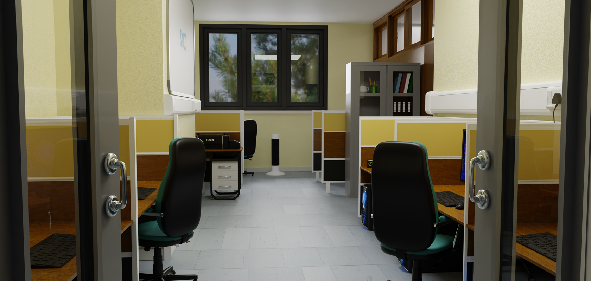
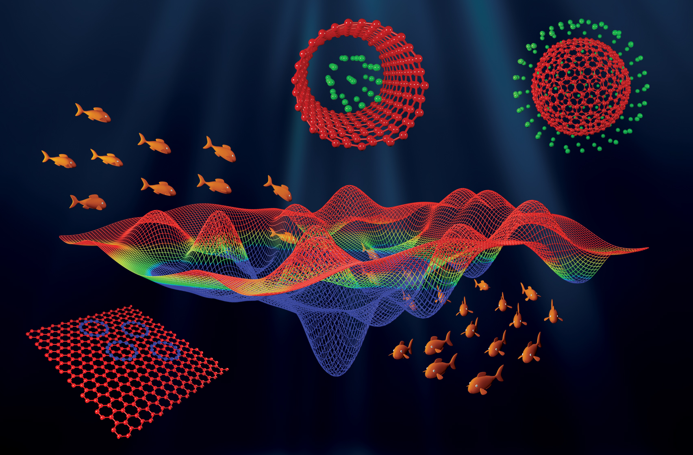

    <h1>Swathi's Multiscale Modelling and Computational Group (SMMACG)</h1>
    

    <h2>Welcome to Swathi's Group</h2>

The activities of our research group are centered on Theoretical Chemistry, with a primary goal of gaining a fundamental understanding of diverse chemical systems and phenomena. We utilize both analytical and computational approaches, drawing on classical and quantum mechanical principles, to achieve this objective. Our research primarily focuses on the following areas:

  <table>
    <tr>
      <td align="center">
         
        <b>Analytical Modelling of Carbon Nanostructures</b>
      </td>
      <td align="center">
         
        <b>Electronic Structure Calculations</b>
      </td>
    </tr>
    <tr>
      <td align="center">
         
        <b>Optical Excitations of Metal Nanoparticles</b>
      </td>
      <td align="center">
         
        <b>Global Optimisation of Clusters</b>
      </td>
    </tr>
  </table>

> ### Publications & Research
> Explore our latest research and publications to gain insights into our work on molecular modeling, computational chemistry, and plasmonics. [Click here to view our publications.](https://faculty.iisertvm.ac.in/swathi/publications)
> Visit our [group website](https://faculty.iisertvm.ac.in/swathi/home) to learn more about our research, team members, and ongoing projects.

