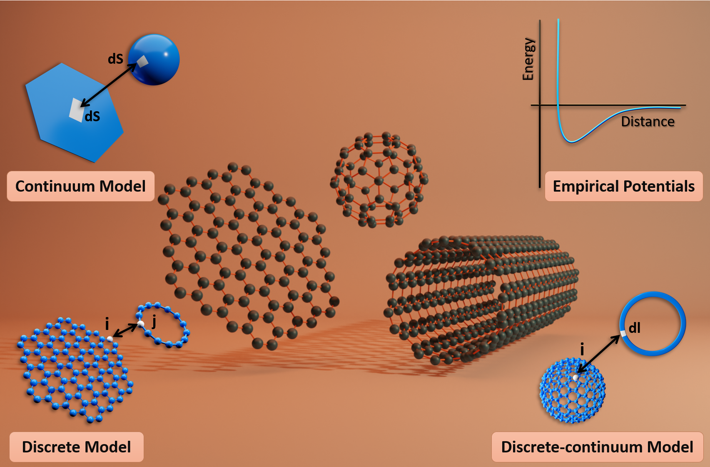

# .github

# Swathi's Multiscale Modelling and Computational Group (SMMACG)
**Advancing Computational Chemistry and Multiscale Modelling**

## Welcome to Swathi's Group 
The activities of our research group are centered on Theoretical Chemistry, with a primary goal of gaining a fundamental understanding of diverse chemical systems and phenomena. We utilize both analytical and computational approaches, drawing on classical and quantum mechanical principles, to achieve this objective. Our research primarily focuses on the following areas:

- **Analytical Modelling of Carbon Nanostructures**

- **Electronic Structure Calculations**
- **Optical Excitations of Metal Nanoparticles**
- **Global Optimistaion of Clusters**

### Dr. R. S. Swathi
Dr. R. S. Swathi was born in Kurnool, Andhra Pradesh. She completed her schooling at Jawahar Navodaya Vidyalaya, Banavasi, Kurnool. She pursued an integrated B.Sc. Ed (Physics, Chemistry, Mathematics) at the Regional Institute of Education, Mysore, followed by an M.Sc. in Chemistry from IIT Guwahati. Dr. Swathi earned her Ph.D. from the Indian Institute of Science, Bangalore, under the guidance of Prof. K. L. Sebastian. Since September 2010, she has been a faculty member at IISER Thiruvananthapuram.

## Contact
**Address**:  
School of Chemistry  
IISER Thiruvananthapuram  
Maruthamala P. O.  
Thiruvananthapuram - 695551

**Phone**: +91 (0)471 - 2778079  
**Mail**: [swathi@iisertvm.ac.in](mailto:swathi@iisertvm.ac.in) (Dr. R. S. Swathi)
